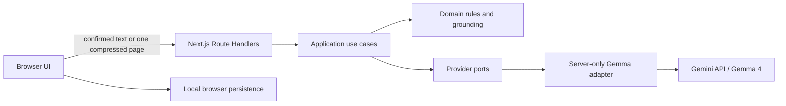

# Ankur

> **Adaptive Learning from Any Source**

[Open the public demo](https://ankur-gamma.vercel.app)

Ankur turns learner-confirmed Bengali, English, or mixed-language material into a source-grounded learning experience. It reviews document extraction with the learner, maps concepts, generates a focused mixed assessment, grades an objective answer deterministically, evaluates a short written answer against a fixed rubric with Gemma 4, and explains weak concepts with exact source evidence.

## The problem

Learners often have trusted notes, handouts, scans, or textbook excerpts but no quick way to convert them into relevant practice and transparent feedback. Generic quiz generators can add unsupported facts, while ordinary OCR does not create an accountable learning loop.

Ankur makes the source boundary visible: the learner confirms the extracted text first, and every generated learning item must cite immutable source segment IDs that the application validates before display.

## Current public flow

```text
PDF, page images, or pasted text
  -> browser-side page extraction and routing
  -> editable extraction review
  -> explicit source confirmation
  -> preparation map
  -> one grounded MCQ + one grounded short-written question
  -> deterministic MCQ grade + rubric-based Gemma grade
  -> evidence-linked result and weak-concept diagnosis
```

The public demo also includes a clearly labelled, provider-free sample so the product remains reviewable when live generation is unavailable.

## Features

- Pasted Bengali, English, or mixed text.
- Up to three-page digital, scanned, or mixed PDF.
- Up to three standalone page images.
- Browser-side PDF parsing, page rendering, and image compression.
- Page-level embedded-text or Gemma transcription routing.
- Editable extraction drafts, uncertainty warnings, and page inclusion controls.
- Deterministic confirmed-source versions and immutable segment IDs.
- Grounded preparation map with topics, concepts, priorities, and evidence.
- One 1-mark MCQ and one 5-mark short-written question.
- Deterministic objective grading and empty-answer handling.
- Criterion-level Gemma 4 written grading with deterministic reconciliation.
- Evidence drawers, concept performance, weak-concept ordering, persistence, and safe recovery.
- Responsive, keyboard-accessible Luminous Knowledge Garden interface.

## How Gemma 4 is used

Gemma 4 is Ankur's only runtime generative model. The application explicitly uses `gemma-4-26b-a4b-it` through Google's hosted Gemini API and the approved `@google/genai` SDK.

Gemma performs page transcription, source analysis, grounded question generation, and criterion-level written-answer judgment. Deterministic application code owns source confirmation, segment creation, evidence validation, MCQ grading, empty-answer handling, mark reconciliation, concept aggregation, and persistence.

No Gemini-branded generative model or other LLM is used by the product.

## Architecture



Ankur is one Next.js App Router modular monolith. Original PDFs remain in the browser; a server route receives only confirmed text or one compressed rendered page per transcription request. Provider credentials and SDK imports remain server-only.

See [architecture](docs/ARCHITECTURE.md), [product specification](docs/PRODUCT_SPEC.md), [security](docs/SECURITY.md), [evaluation](docs/EVALUATION.md), and [limitations](docs/LIMITATIONS.md).

## Technology

- Next.js 16 App Router, React 19, strict TypeScript.
- Zod for API, provider-output, persistence, and domain-boundary validation.
- `@google/genai` for hosted Gemma 4 access.
- `pdfjs-dist` and browser Canvas for document processing.
- Motion for React for restrained, reduced-motion-safe transitions.
- Vitest, React Testing Library, Playwright, and axe-core.
- Vercel deployment with Node.js Route Handlers and Fluid Compute.

## Local setup

Requirements: Node.js 24 and npm.

```bash
git clone https://github.com/saminul-amin/ankur.git
cd ankur
npm ci
cp .env.example .env.local
npm run dev
```

For Windows PowerShell, copy the environment template with:

```powershell
Copy-Item .env.example .env.local
```

`GEMINI_API_KEY` is required only for explicitly enabled live operations. Keep it in the server environment and never prefix it with `NEXT_PUBLIC_`.

Quality checks do not require provider access:

```bash
npm run lint
npm run typecheck
npm test
npm run build
npm run test:e2e
```

Live verification and reliability commands require their own explicit opt-in flags and are intentionally excluded from ordinary tests and CI.

## Evaluation evidence

Repository-owned reports record only redacted, reproducible metadata:

- Provider Gate 1: Bengali text, Bengali image transcription, native structured output, thinking controls, and typed error mapping passed.
- Document ingestion: digital, scanned, mixed-PDF, and standalone-image routing passed.
- Mixed assessment: correct `5/5`, partial `2/5`, and deterministic empty `0/5` written results reconciled successfully.
- Current offline matrix: 84 Vitest tests and 20 applicable Playwright cases passed; the dependency audit reported zero vulnerabilities.
- The latest Task 04B provider sample did not meet its release gate (8/9 final-valid and 3/9 first-pass), so live AI remains feature-gated while the provider-free sample stays available.

See the [evaluation directory](evaluation) for the recorded fixtures, methodology, screenshots, and limitations. These are bounded prototype measurements, not claims of universal accuracy.

## Privacy and security

- Source content is transmitted to Google's hosted Gemini API only for the requested live operation.
- The server does not intentionally retain uploaded documents or full student answers.
- Browser session data can be removed with **Clear session**.
- Do not use the prototype for confidential, regulated, or examination-restricted material.
- AI endpoints are narrow schema-constrained operations, not a generic prompt proxy.
- Live generation has an emergency kill switch, payload limits, and per-session/IP protection.
- Written grading is an AI estimate, not an official academic grade.

## Limitations

The current release supports one source session and a fixed two-question assessment. Provider latency and quota vary; measured live operations can approach 80 seconds and the current reliability benchmark is blocked, so production live AI may be disabled. In-memory rate limiting is not durable across serverless instances. Authentication, cloud history, revision notes, weak-area retry, timers, negative marking, and additional question types are not part of this release.

Read the complete [limitations and release boundaries](docs/LIMITATIONS.md).

## Team

Built by **Team Hotasha**:

- Mahdi Hasan Qurishi — team and submission lead.
- Md. Saminul Amin — technical lead.

## Licence and acknowledgements

Application source is licensed under the [Apache License 2.0](LICENSE).

Gemma and the Gemini API are Google technologies and remain subject to their applicable licences and service terms. Ankur does not distribute model weights.
