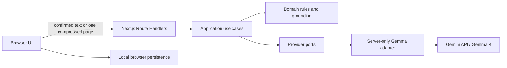

# Ankur

> **Adaptive Learning from Any Source**

[Open the public demo](https://ankur-gamma.vercel.app)

Ankur turns learner-confirmed Bengali, English, or mixed-language material into a source-grounded adaptive learning experience. It reviews document extraction, maps concepts, generates and grades a focused mixed assessment, builds evidence-linked personalized revision, offers a targeted retry, and compares the two attempts deterministically.

## The problem

Learners often have trusted notes, handouts, scans, or textbook excerpts but no quick way to convert them into relevant practice and transparent feedback. Generic quiz generators can add unsupported facts, while ordinary OCR does not create an accountable learning loop.

Ankur makes the source boundary visible: the learner confirms the extracted text first, and every generated learning item must cite immutable source segment IDs that the application validates before display.

## Current public flow

```text
PDF, page images, or pasted text
  -> browser-side page extraction and routing
  -> editable extraction review
  -> explicit source confirmation
  -> preparation map
  -> one grounded MCQ + one grounded short-written question
  -> deterministic MCQ grade + rubric-based Gemma grade
  -> evidence-linked result and weak-concept diagnosis
  -> grounded revision plan
  -> weak-area, reinforcement, or optional challenge retry
  -> deterministic original-versus-retry comparison
```

The public demo also includes a clearly labelled, provider-free sample so the product remains reviewable when live generation is unavailable.

## Features

- Pasted Bengali, English, or mixed text.
- Up to three-page digital, scanned, or mixed PDF.
- Up to three standalone page images.
- Browser-side PDF parsing, page rendering, and image compression.
- Page-level embedded-text or Gemma transcription routing.
- Editable extraction drafts, uncertainty warnings, and page inclusion controls.
- Deterministic confirmed-source versions and immutable segment IDs.
- Grounded preparation map with topics, concepts, priorities, and evidence.
- One 1-mark MCQ and one 5-mark short-written question.
- Deterministic objective grading and empty-answer handling.
- Criterion-level Gemma 4 written grading with deterministic reconciliation.
- Evidence drawers, concept performance, weak-concept ordering, persistence, and safe recovery.
- Deterministic revision targeting without fabricated weaknesses.
- Source-grounded revision notes plus one retry MCQ and one retry short-written question.
- Deterministic attempt comparison with cautious, non-mastery claims.
- Responsive, keyboard-accessible Luminous Knowledge Garden interface.

## How Gemma 4 is used

Gemma 4 is Ankur's only runtime generative model. The application explicitly uses `gemma-4-26b-a4b-it` through Google's hosted Gemini API and the approved `@google/genai` SDK.

Gemma performs page transcription, source analysis, grounded question generation, bounded revision personalization, and criterion-level written-answer judgment. Deterministic application code owns source confirmation, segment creation, revision targeting and factual note fields, evidence validation, MCQ grading, empty-answer handling, mark reconciliation, concept aggregation, attempt comparison, and persistence.

No Gemini-branded generative model or other LLM is used by the product.

## Architecture



Ankur is one Next.js App Router modular monolith. Original PDFs remain in the browser; a server route receives only confirmed text or one compressed rendered page per transcription request. Provider credentials and SDK imports remain server-only.

See [architecture](docs/ARCHITECTURE.md), [product specification](docs/PRODUCT_SPEC.md), [security](docs/SECURITY.md), [evaluation](docs/EVALUATION.md), and [limitations](docs/LIMITATIONS.md).

## Technology

- Next.js 16 App Router, React 19, strict TypeScript.
- Zod for API, provider-output, persistence, and domain-boundary validation.
- `@google/genai` for hosted Gemma 4 access.
- `pdfjs-dist` and browser Canvas for document processing.
- Motion for React for restrained, reduced-motion-safe transitions.
- Vitest, React Testing Library, Playwright, and axe-core.
- Vercel deployment with Node.js Route Handlers and Fluid Compute.

## Local setup

Requirements: Node.js 24 and npm.

```bash
git clone https://github.com/saminul-amin/ankur.git
cd ankur
npm ci
cp .env.example .env.local
npm run dev
```

For Windows PowerShell, copy the environment template with:

```powershell
Copy-Item .env.example .env.local
```

`GEMINI_API_KEY` is required only for explicitly enabled live operations. Keep it in the server environment and never prefix it with `NEXT_PUBLIC_`.

## Manual release verification

The hackathon release uses a locked, provider-free manual gate. Run it from the exact committed tree that will be deployed:

```bash
npm ci
npm run lint
npm run typecheck
npm test
npm run build
npm run test:e2e
npm audit --audit-level=moderate
git diff --check
```

Hosted CI is intentionally deferred for this prototype; it is not replaced by another CI service. Maintainers run every command above locally, push the verified commit, deploy that same commit to Vercel, and confirm that the local, GitHub, and production build IDs match.

Live verification and reliability commands require their own explicit opt-in flags and are separate from the provider-free manual gate.

## Evaluation evidence

Repository-owned reports record only redacted, reproducible metadata:

- Provider Gate 1: Bengali text, Bengali image transcription, native structured output, thinking controls, and typed error mapping passed.
- Document ingestion: digital, scanned, mixed-PDF, and standalone-image routing passed.
- Mixed assessment: correct `5/5`, partial `2/5`, and deterministic empty `0/5` written results reconciled successfully.
- Current offline matrix: 102 Vitest tests and 22 applicable Playwright cases passed; 6 project-specific mobile fixture duplicates are intentionally skipped and the dependency audit reported zero vulnerabilities.
- The explicit Task 05 live adaptive verification completed a grounded weak-area revision and retry from `0/6` to `6/6`, with zero grounding, quote, concept-reference, reconciliation, duplicate, persistence, or state-loss failures in that bounded run.
- The latest explicit-opt-in provider benchmark reached 9/9 final-valid operations with zero grounding, quote, concept, or mark-reconciliation failures. First-pass validity was 9/9 in that bounded run and remains an optimization metric, not a separate release blocker.

See the [evaluation directory](evaluation) for the recorded fixtures, methodology, screenshots, and limitations. These are bounded prototype measurements, not claims of universal accuracy.

## Privacy and security

- Source content is transmitted to Google's hosted Gemini API only for the requested live operation.
- The server does not intentionally retain uploaded documents or full student answers.
- Browser session data can be removed with **Clear session**.
- Do not use the prototype for confidential, regulated, or examination-restricted material.
- AI endpoints are narrow schema-constrained operations, not a generic prompt proxy.
- Live generation has an emergency kill switch, payload limits, and per-session/IP protection.
- Written grading is an AI estimate, not an official academic grade.

## Limitations

The current release supports one source session, one fixed two-question assessment, one bounded revision plan, and one two-question retry. A single retry can show short-term performance change but cannot prove durable learning. Provider latency and quota vary, and production live AI may be disabled after verification while the labelled sample remains available. In-memory rate limiting is not durable across serverless instances. Authentication, cloud history, timers, negative marking, spaced repetition, and additional question types are not part of this release.

Read the complete [limitations and release boundaries](docs/LIMITATIONS.md).

## Team

Built by **Team Hotasha**:

- Mahdi Hasan Qurishi — team and submission lead.
- Md. Saminul Amin — technical lead.

## Licence and acknowledgements

Application source is licensed under the [Apache License 2.0](LICENSE).

Gemma and the Gemini API are Google technologies and remain subject to their applicable licences and service terms. Ankur does not distribute model weights.
